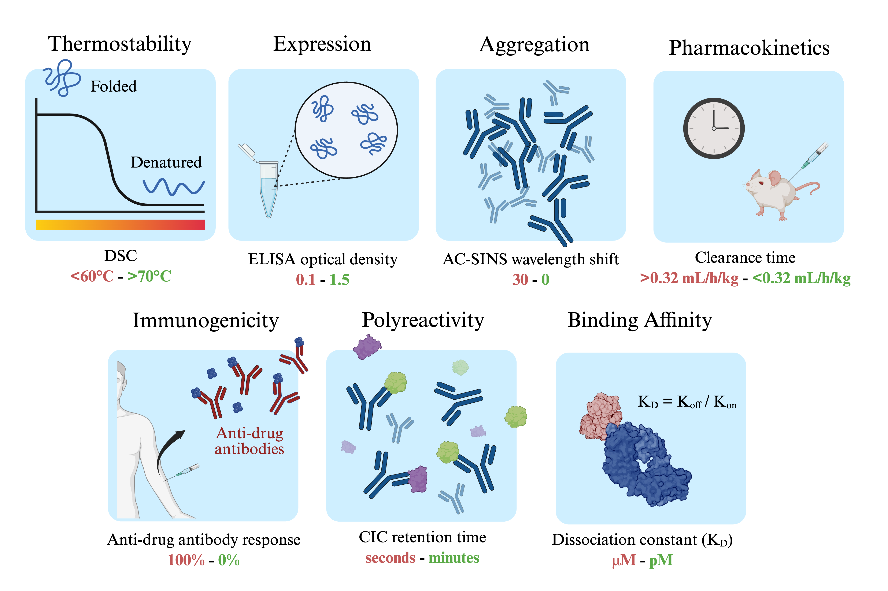

# FLAb: Fitness Landscapes for Antibodies

## Summary
`The Fitness Landscape for Antibodies (FLAb)` is the largest publicly available therapeutic antibody dataset designed to train and benchmark protein AI models. It provides open-access, high-quality developability data on diverse therapeutic properties, including expression, thermostability, immunogenicity, aggregation, polyreactivity, binding affinity, and pharmacokinetics. FLAb encompasses over 3 million antibody developability assay data points, aggregated from public studies. Each dataset is stored in CSV format, with columns representing the amino acid sequence(s) of antibody variable domains (e.g., one column per chain for two-chain antibodies) and the corresponding therapeutic assay value. Additional metadata columns may also be included. A convenience interface to the FLAb Github repository can be found [here](https://r2.graylab.jhu.edu/flab?current_page=1&key_words_value=&category=aggregation&assay=any&study=any&year=any&license=any&size=any&).



## About

The FLAb dataset is used to benchmark and train protein AI models for (1) therapeutic antibody design and prediction of therapeutic properties. FLAb represents a unique, centralized resource encompassing diverse and experimentally validated therapeutic antibody properties, including data from assays commonly used in antibody discovery pipelines. To date, no publicly available dataset has been compiled at this scale or breadth, making FLAb a first-of-its-kind tool for the protein design and AI research communities. By providing access to high-quality, multi-dimensional benchmark data, FLAb supports the development of models that generate or filter optimized antibody candidates more efficiently than current experimental approaches. Our long-term vision is for FLAb to serve as a foundation for advancing therapeutic antibody design.

## Data

The dataset has been partitioned based on therapeutic properties (e.g., "expression," "thermostability," "binding affinity") into separate folders within [the data directory](https://github.com/Graylab/FLAb/tree/main/data).

```
├── data/
|    ├── README.md
|    ├── aggregation/
|    |    ├── README.md
|    |    ├── jain2017biophyscial_HICRT.csv
|    |    ├── jain2017biophysical_ACSINS.csv
|    |    ├── ...
|    |    └── shanehsazzadeh2023unlocking_SEC.csv
|    ├── binding/
|    |    ├── README.md
|    |    ├── AbRank_dataset.csv.zip
|    |    ├── adams2017measuring_4420-fluorescein_kd-flow.csv
|    |    ├── ...
|    |    ├── zimmerman2020antibody_4420_kd.csv
|    ├── expression/
|    |    ├── ...
|    ├── immunogenicity/
|    |    ├── ...
|    ├── immunogenicity/
|    |    ├── ...
|    ├── pharmacokinetics
|    |    ├── ...
|    ├── polyreactivity/
|    |    ├── ...
|    ├── thermostability/
|    |    ├── ...
```
The [README.md](https://github.com/Graylab/FLAb/tree/main/data#readme) file within the data directory provides a tabular description of the with the study name, a link to the study, the shorthand naming convention used for the corresponding CSV file, the amount of data the study provides in each developability category, and the associated license of the data.

The README.md file provided in each respective fitness category folder provides a description of each dataset in that folder, including size, assay units, key words associated with that file (such as "germline", "clinical stage", "nanobody", "SARS-CoV-2"), the associated publication and link, the year of the publication, and the direction of favorable (higher fitness) values. For example, the [expression README.md](https://github.com/Graylab/FLAb/tree/main/data/expression) provides a description for all the expression datasets.

## Examples

Examples of zero shot and few shot scoring are in the [examples directory](https://github.com/Graylab/FLAb/tree/main/examples).
## Install

For easiest use, [create a conda environment](https://docs.conda.io/projects/conda/en/latest/user-guide/tasks/manage-environments.html#creating-an-environment-with-commands) for each scoring and structure prediction method:

```bash
$ conda env create --name ENV_NAME --file envs/[ENV]
```

&nbsp;&nbsp;&nbsp;&nbsp;&nbsp;&nbsp; Where `[ENV]` ∈ `antiberty.yml`, `esmif.yml`, `iglm.yml`, `mpnn.yml`, `progen.yml`, `pyrosetta.yml`

## Command line usage

FLAb supports structure prediction with IgFold and perplexity scoring with AntiBERTy, ProGen2, IgLM, ESM-2, ESM-IF, proteinMPNN, and Rosetta energy.

### Antibody structure prediction from sequence in csv format

Antibody sequences must be provided as a csv of sequences, where the columns are chains `heavy` and `light` and column values are the sequences. This step is necessary to complete first before scoring with structure-based methods (i.e. ESM-IF, proteinMPNN, Rosetta energy).

```bash
$ sbatch sbatch/structure.sh data/tm/Hie2022_C143_Tm.csv 
```

### Expected output

After the script completes, antibody structures will be saved in a new directory path `structures/tm/Hie2022_C143_Tm/`

## Perplexity scoring and correlation to fitness

Calculate perplexity for a csv of sequences with the columns `heavy` for heavy chain sequences, `light` for light chain sequences, and `fitness` for some experimental antibody fitness metric.

```bash
$ sbatch sbatch/score_seq.sh data/tm/Hie2022_C143_Tm.csv [MODEL] [SIZE]
```

&nbsp;&nbsp;&nbsp;&nbsp;&nbsp;&nbsp; Where `[MODEL]` ∈ `antiberty`, `esmif`, `iglm`, `mpnn`, `progen`, `pyrosetta`

&nbsp;&nbsp;&nbsp;&nbsp;&nbsp;&nbsp; If using `progen`: `[SIZE]` ∈ `small`, `medium`, `base`, `oas`, `large`, `BFD90`, `xlarge`. Otherwise leave `[SIZE]` blank.

For structure-based scoring methods, structures must first be predicted.

```bash
$ sbatch sbatch/score_struc.sh data/tm/Hie2022_C143_Tm.csv esmif
```

### Expected output

After the script completes, the CSV with heavy and light sequences will be updated with a new column for uncertainty. The CSV will be saved in a new directory path within `scores/tm/Hie2022_C143_Tm/`

## Contributions & Bug reports

FLAb is a living benchmark: We are motivated to continually expand the antibody fitness data utilized and methods evaluated. We invite contributions and encourage contributors to add data or test new models (e.g. ESM-2, CDConv, ProNet, MaSIF, MIF, CARP, ProtBERT, UniRep, ProteinBERT). To make contributions, either submit a [pull request](https://github.com/Graylab/FLAb/pulls) or email `mchungy1@jhu.edu` for help on how to integrate your data into FLAb.

If you run into any problems while using FLAb, please create a [Github issue](https://github.com/Graylab/FLAb/issues) with a description of the problem and the steps to reproduce it.

## Citing this work

```bibtex
@article{chungyoun2023flab,
    title = {FLAb: Benchmarking tasks in fitness landscape inference for antibodies},
    author = {Chungyoun, Michael and Ruffolo, Jeff and Gray, Jeffrey J},
    journal = {bioRxiv},
    doi = {https://doi.org/10.1101/2024.01.13.575504}
    year = {2023}
}
```

### License

The license of each dataset can be found in https://github.com/Graylab/FLAb/blob/main/data/README.md
